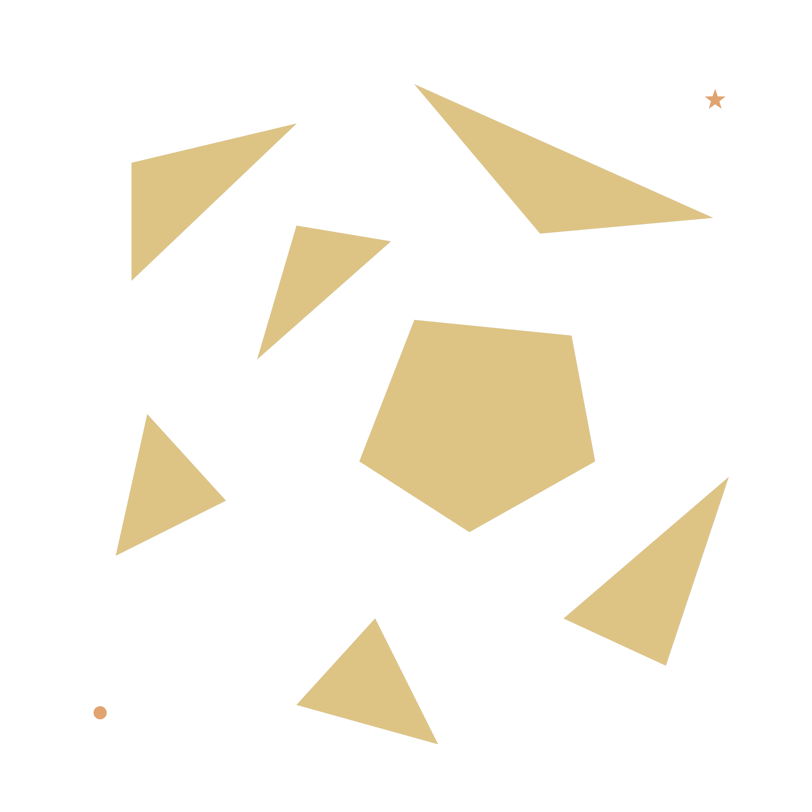
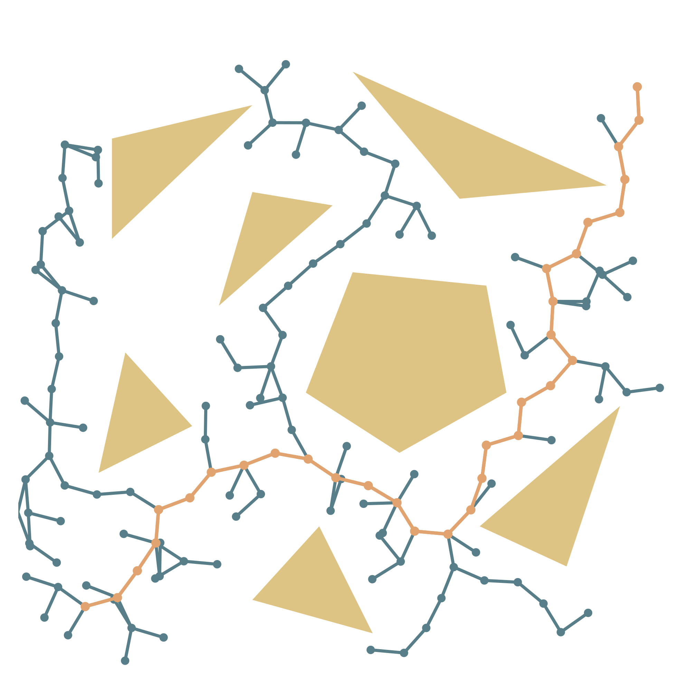
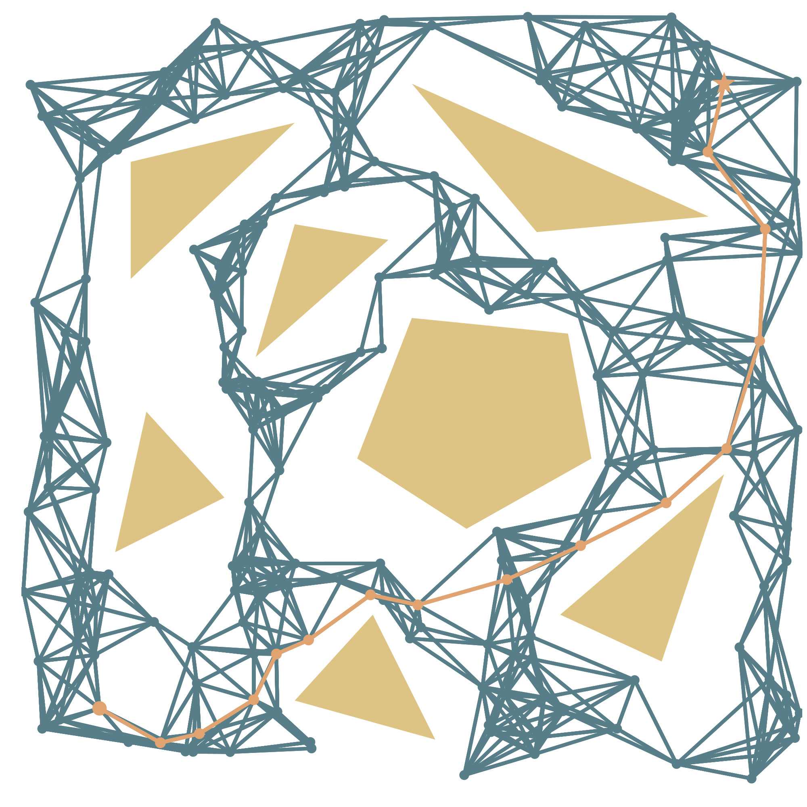

# PathFinder.jl - Sampling-Based Path Planning Algorithms in Julia

This Julia package provides implementations of two popular sampling-based path planning algorithms:

- Rapidly exploring random tree (**RRT**)

| | |
|--------------------------------------|--------------------------------------|

- Probabilistic roadmap (the simplified, k-nearest variant: **k-Nearest sPRM**)

| | |
|--------------------------------------|--------------------------------------|

## Installation

This package is not registered, but you can install it using Julia's Pkg package manager:

```julia
(@v1.10) pkg> add https://github.com/B0B36JUL-FinalProjects-2024/Project_draholeo
```

## Usage

1. Define your `PlanningSpace`

    ```julia
    using PathFinder

    dimension_of_my_configuration_space = 2
    limits_matrix_of_my_configuration_space = [0 1; 0 1]
    my_collision_checker = conf -> false  # environment with no obstacles

    ps = PlanningSpace(
        dim=dimension_of_my_configuration_space,
        limits=limits_matrix_of_my_configuration_space,
        collision_check=my_collision_checker,
        collision_resolution=0.01)
    ```
    where:
    - `PlanningSpace.dim` is the dimension of the configuration space
    - `PlanningSpace.limits` is (dim, 2) `Matrix` with [min, max] for each dimension
    - `PlanningSpace.collision_check` is a user-defined function that takes a configuration (a dim-dimensional vector) as input and returns `true` if the configuration is in collision with an obstacle, otherwise `false`
    - `PlanningSpace.collision_resolution` defines the resolution at which the planner checks for collisions along a path (smaller values result in finer collision checks but may slow down planning)

2. Select your favorite planner

    ```julia
    planner = RRTPlanner(step_size=0.05, max_iters=10000, tolerance=0.05)
    ```
    or
    ```julia
    planner = PRMPlanner(roadmap_size=200, k_neighbors=8)
    ```


3. Run the `plan` function
    
    ```julia
    start_conf = [0.1, 0.1]
    goal_conf = [0.9, 0.9]
    path, graph = plan(start_conf, goal_conf, ps, planner)
    ```
    which returns:
    - `path` from start_conf to goal_conf ((dim, num_of_waypoints) `Matrix{Float64}`) or `nothing` if the planning algorithm could not find a collision-free path
    - `graph` which is either a `PathFinder.Graph` for PRM algorithm or `PathFinder.Tree` for RRT algorithm

For a complete working example, see [examples/example.jl](examples/example.jl).

## Author

Leoš Drahotský (draholeo@fel.cvut.cz)

## License

This project is licensed under the [MIT License](LICENSE) - see the LICENSE file for details.
